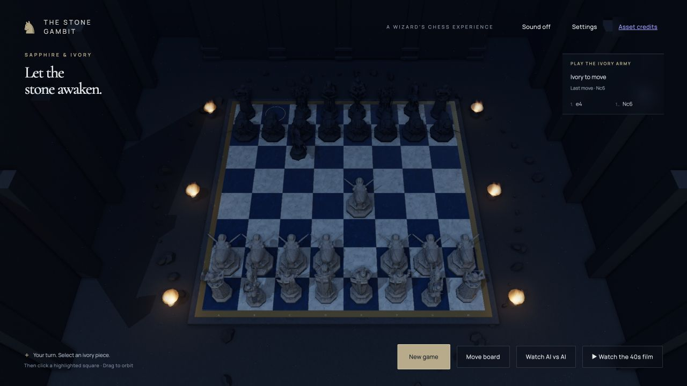

# The Stone Gambit

Playable wizard's chess. Stone pieces come to life, captures become miniature battles, and a cinematic mode stages six legal capture studies.

[Play the game](https://the-stone-gambit.vercel.app/) · [Asset credits](docs/ASSETS.md) · [Architecture](docs/ARCHITECTURE.md)



An AI-assisted development experiment built with Codex, Blender, image generation, and Three.js. The opponent runs locally in your browser—no ChatGPT connection, account, or API key is required. The underlying sculptures are credited third-party models, not AI-generated meshes.

## Run locally

Use Node.js 22.12 or later (Node 22 LTS recommended).

```sh
npm ci
npm run dev -- --port 5178
```

Open the local URL printed by Vite. For a production build:

```sh
npm run build
npm run preview
```

## Play

- Play ivory against the sapphire computer: select a piece, then a highlighted legal square.
- Use **Move board** for conventional square-by-square controls.
- Switch to computer-vs-computer to watch a game, or reset to start over.
- Watch the cinematic film; exit it to return to chess.
- Record the 40-second film in a browser supporting WebCodecs H.264/AAC. Keep the tab visible during recording; the result downloads as an MP4.

Rules come from `chess.js`, including castling, en passant, promotion, checkmate, and draws. The opponent is a lightweight depth-two alpha-beta search, not Stockfish or a live language model.

## Development

```sh
npm run check
npm run format
```

`check` runs formatting, automated tests, the production build, and publication checks. See [development](docs/DEVELOPMENT.md), [contributing](CONTRIBUTING.md), and [security](SECURITY.md).

## Scope and limits

The runtime assets total approximately 75 MB. A modern hardware-accelerated desktop browser is recommended; startup and recording can be demanding. Combat uses procedural skeletal animation, not motion capture. The film is six separate capture studies, not a continuous match. Browser codec support varies.

This repository contains the runnable game and optimized assets, not the original Blender workspace or generation history. The hosted demo may differ from later repository revisions.

## License

Original code is MIT licensed. Models and fonts have separate licenses and attribution requirements; see [NOTICE](NOTICE) and [asset documentation](docs/ASSETS.md).

Unofficial fan project. Not affiliated with or endorsed by OpenAI or the Harry Potter rights holders. Asset licensing does not grant rights to third-party characters or brands.
